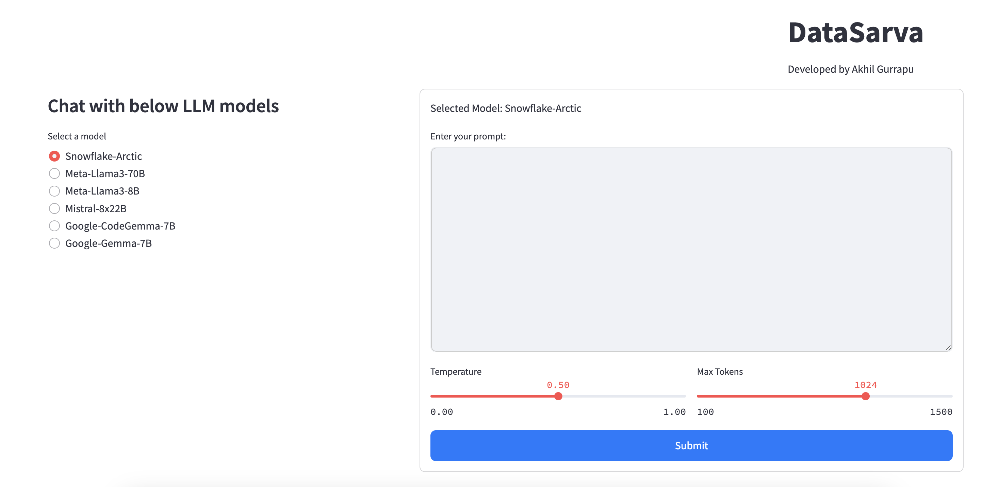

# Chatting with New Open Large Language Models

 <!-- Replace 'path/to/your/image.jpg' with the actual path to your image -->

## Project Overview

This project explores and compares the capabilities of various newly released large language models (LLMs). Our focus is on evaluating these models in a chat application context, providing insights into their performance, nuances, and usability. The models included in this study are:

- **Snowflake-Arctic**
- **Meta-Llama3-70B**
- **Meta-Llama3-8B**
- **Mistral-8x22B**
- **Google-CodeGemma-7B**
- **Google-Gemma-7B**

Each of these models represents cutting-edge advancements in AI language processing, developed by leading organizations in AI research.

## Features

- **Model Comparison:** Evaluate the conversational abilities of each model on a set of standardized prompts.
- **Performance Metrics:** Analyze response time, coherence, and relevance of responses from each model.
- **User Experience Testing:** Gather feedback from real users interacting with the models to assess practical usability.

## Installation

To set up this project, clone this repository and install the required dependencies:

```bash
git clone https://github.com/yourgithubusername/project-repository-name.git
cd project-repository-name
pip install -r requirements.txt
